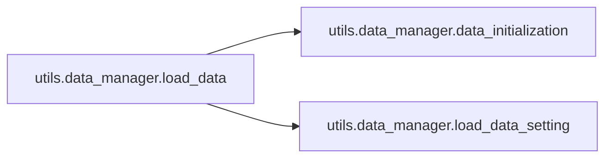

# Utils Data

[_Documentation generated by Documatic_](https://www.documatic.com)

<!---Documatic-section-Codebase Structure-start--->
## Codebase Structure

<!---Documatic-block-system_architecture-start--->
```mermaid
None
```
<!---Documatic-block-system_architecture-end--->

# #
<!---Documatic-section-Codebase Structure-end--->

<!---Documatic-section-utils.data_manager.save_data_setting-start--->
## [utils.data_manager.save_data_setting](3-utils_data.md#utils.data_manager.save_data_setting)

<!---Documatic-section-save_data_setting-start--->
<!---Documatic-block-utils.data_manager.save_data_setting-start--->
<details>
	<summary><code>utils.data_manager.save_data_setting</code> code snippet</summary>

```python
def save_data_setting(data, save_file):
    new_data = copy.deepcopy(data)
    new_data.train_texts = []
    new_data.dev_texts = []
    new_data.test_texts = []
    new_data.raw_texts = []
    new_data.train_Ids = []
    new_data.dev_Ids = []
    new_data.test_Ids = []
    new_data.raw_Ids = []
    with open(save_file, 'wb') as fp:
        pickle.dump(new_data, fp)
    print('Data setting saved to file: ', save_file)
```
</details>
<!---Documatic-block-utils.data_manager.save_data_setting-end--->
<!---Documatic-section-save_data_setting-end--->

# #
<!---Documatic-section-utils.data_manager.save_data_setting-end--->

<!---Documatic-section-utils.data_manager.load_data_setting-start--->
## [utils.data_manager.load_data_setting](3-utils_data.md#utils.data_manager.load_data_setting)

<!---Documatic-section-load_data_setting-start--->
<!---Documatic-block-utils.data_manager.load_data_setting-start--->
<details>
	<summary><code>utils.data_manager.load_data_setting</code> code snippet</summary>

```python
def load_data_setting(save_file):
    with open(save_file, 'rb') as fp:
        data = pickle.load(fp)
    print('Data setting loaded from file: ', save_file)
    data.show_data_summary()
    return data
```
</details>
<!---Documatic-block-utils.data_manager.load_data_setting-end--->
<!---Documatic-section-load_data_setting-end--->

# #
<!---Documatic-section-utils.data_manager.load_data_setting-end--->

<!---Documatic-section-utils.data_manager.data_initialization-start--->
## [utils.data_manager.data_initialization](3-utils_data.md#utils.data_manager.data_initialization)

<!---Documatic-section-data_initialization-start--->
<!---Documatic-block-utils.data_manager.data_initialization-start--->
<details>
	<summary><code>utils.data_manager.data_initialization</code> code snippet</summary>

```python
def data_initialization(data, char_emb, gaz_file, train_file, dev_file, test_file, re2id_file, word_sense_map_file):
    data.build_words_larger_one_set(char_emb)
    data.build_word_sense_map(word_sense_map_file)
    data.build_alphabet(train_file)
    data.build_alphabet(dev_file)
    data.build_alphabet(test_file)
    data.build_label_alphabet(re2id_file)
    data.build_gaz_file(gaz_file)
    data.build_gaz_alphabet(train_file)
    data.build_gaz_alphabet(dev_file)
    data.build_gaz_alphabet(test_file)
    data.fix_alphabet()
    return data
```
</details>
<!---Documatic-block-utils.data_manager.data_initialization-end--->
<!---Documatic-section-data_initialization-end--->

# #
<!---Documatic-section-utils.data_manager.data_initialization-end--->

<!---Documatic-section-utils.data_manager.load_data-start--->
## [utils.data_manager.load_data](3-utils_data.md#utils.data_manager.load_data)

<!---Documatic-section-load_data-start--->


### Object Calls

* [utils.data_manager.data_initialization](3-utils_data.md#utils.data_manager.data_initialization)
* [utils.data_manager.load_data_setting](3-utils_data.md#utils.data_manager.load_data_setting)

<!---Documatic-block-utils.data_manager.load_data-start--->
<details>
	<summary><code>utils.data_manager.load_data</code> code snippet</summary>

```python
def load_data(status='train'):
    public_path = configure.public_path
    dataset = os.path.join(public_path, configure.dataset)
    train_file = os.path.join(dataset, configure.train_file)
    dev_file = os.path.join(dataset, configure.dev_file)
    test_file = os.path.join(dataset, configure.test_file)
    re2id_file = os.path.join(dataset, configure.relation2id)
    word_sense_map_file = os.path.join(public_path, configure.word_sense_map)
    weights_mode = configure.weights_mode.lower()
    gpu = torch.cuda.is_available()
    char_emb = os.path.join(public_path, configure.char_emb_file)
    bichar_emb = None
    gaz_file = os.path.join(public_path, configure.sense_emb_file)
    print('CuDNN:', torch.backends.cudnn.enabled)
    print('GPU available:', gpu)
    print('Train file:', train_file)
    print('Dev file:', dev_file)
    print('Test file:', test_file)
    print('Char emb:', char_emb)
    print('Bichar emb:', bichar_emb)
    print('Gaz file:', gaz_file)
    if status == 'train':
        data = Data()
        data.HP_use_char = False
        data.use_bigram = False
        data.norm_gaz_emb = False
        data.HP_fix_gaz_emb = False
        data.Encoder = configure.Encoder
        data.HP_gpu = gpu
        data.HP_batch_size = 1
        data.gaz_dropout = 0.5
        data.HP_lr = configure.lr
        data.set_maxlen(configure.max_length)
        data_initialization(data, char_emb, gaz_file, train_file, dev_file, test_file, re2id_file, word_sense_map_file)
        data.generate_instance_with_gaz(train_file, 'train', load_mode='ins')
        data.generate_instance_with_gaz(dev_file, 'dev', load_mode='multilab-ins')
        data.generate_instance_with_gaz(test_file, 'test', load_mode='multilab-ins')
        data.build_weights(weights_mode)
        data.build_word_pretrain_emb(char_emb)
        data.build_biword_pretrain_emb(bichar_emb)
        data.build_gaz_pretrain_emb(gaz_file)
    elif status == 'test':
        data = load_data_setting(configure.savedset)
        data.generate_instance_with_gaz(test_file, 'test', load_mode='multilab-ins')
    return data
```
</details>
<!---Documatic-block-utils.data_manager.load_data-end--->
<!---Documatic-section-load_data-end--->

# #
<!---Documatic-section-utils.data_manager.load_data-end--->

[_Documentation generated by Documatic_](https://www.documatic.com)