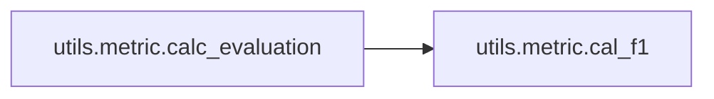

# Utils Metric

[_Documentation generated by Documatic_](https://www.documatic.com)

<!---Documatic-section-Codebase Structure-start--->
## Codebase Structure

<!---Documatic-block-system_architecture-start--->
```mermaid
None
```
<!---Documatic-block-system_architecture-end--->

# #
<!---Documatic-section-Codebase Structure-end--->

<!---Documatic-section-utils.metric.cal_f1-start--->
## [utils.metric.cal_f1](4-utils_metric.md#utils.metric.cal_f1)

<!---Documatic-section-cal_f1-start--->
<!---Documatic-block-utils.metric.cal_f1-start--->
<details>
	<summary><code>utils.metric.cal_f1</code> code snippet</summary>

```python
def cal_f1(x, y):
    return 2.0 * x * y / (x + y + 1e-20)
```
</details>
<!---Documatic-block-utils.metric.cal_f1-end--->
<!---Documatic-section-cal_f1-end--->

# #
<!---Documatic-section-utils.metric.cal_f1-end--->

<!---Documatic-section-utils.metric.calc_evaluation-start--->
## [utils.metric.calc_evaluation](4-utils_metric.md#utils.metric.calc_evaluation)

<!---Documatic-section-calc_evaluation-start--->


### Object Calls

* [utils.metric.cal_f1](4-utils_metric.md#utils.metric.cal_f1)

<!---Documatic-block-utils.metric.calc_evaluation-start--->
<details>
	<summary><code>utils.metric.calc_evaluation</code> code snippet</summary>

```python
def calc_evaluation(y_ans, y_pred):

    def softmax(x):
        return np.exp(x) / np.sum(np.exp(x), axis=0)
    y_prob = [softmax(y) for y in y_pred]
    y_pred = np.array([np.argmax(i) for i in y_prob])
    y_prob = np.array([y_prob[i][j] for (i, j) in enumerate(y_pred)])
    true_num = len([i for i in y_ans if len(i) > 1 or i[0] > 0])
    test_result = []
    for idx in range(len(y_ans)):
        rel = y_pred[idx]
        if rel != 0:
            test_result.append({'score': y_prob[idx], 'flag': 1 if rel in y_ans[idx] else 0})
    sorted_test_result = sorted(test_result, key=lambda x: x['score'])
    prec = []
    recall = []
    correct = 0
    for (i, item) in enumerate(sorted_test_result[::-1]):
        correct += item['flag']
        prec.append(float(correct) / (i + 1))
        recall.append(float(correct) / true_num)
    prec = np.array(prec)
    recall = np.array(recall)
    indxs = [i for i in range(len(recall))]
    x = recall[indxs]
    y = prec[indxs]
    auc = sklearn.metrics.auc(x=x, y=y)
    f1 = cal_f1(prec, recall)
    return (prec[-1], recall[-1], f1[-1], auc)
```
</details>
<!---Documatic-block-utils.metric.calc_evaluation-end--->
<!---Documatic-section-calc_evaluation-end--->

# #
<!---Documatic-section-utils.metric.calc_evaluation-end--->

[_Documentation generated by Documatic_](https://www.documatic.com)